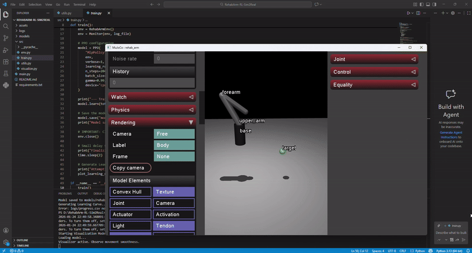

# 🤖 RehabArm-RL: Sim-to-Real Pipeline for Assistive Robotics

<div align="center">


A modern reinforcement learning framework for training and deploying control policies for 2-DOF assistive robotic arms with sim-to-real transfer capabilities.

</div>

---

## 📋 Overview

This project demonstrates a state-of-the-art **Reinforcement Learning pipeline** designed specifically for rehabilitation robotics. The agent learns to control a 2-DOF assistive arm to reach target coordinates while optimizing for:

- ✅ **Clinical Safety** - Smooth, predictable movements suitable for patient interaction
- ✅ **Comfort** - Minimized torque jerk to prevent uncomfortable accelerations
- ✅ **Generalization** - Domain randomization for real-world hardware deployment

Powered by **PPO** (Proximal Policy Optimization) and **MuJoCo** physics simulation, this framework bridges the gap between simulation training and real robotic systems.

---

## � Demo & Visualization

<div align="center">

[](assets/demo.gif)

*Trained RehabArm agent reaching target coordinates in real-time*

</div>

To see the agent in action:
```bash
python main.py --mode visualize
```

---

## �🎯 Key Features

### 🏥 Medical-Aware Reward Function
- Implements torque jerk penalties (derivative of control actions)
- Ensures smooth, comfortable movements suitable for rehabilitation therapy
- Balances task completion with movement quality

### 🔄 Domain Randomization for Sim-to-Real Transfer
- Automatically varies link masses and joint friction during training
- Policy learns to generalize across different physical hardware characteristics
- Reduces performance drop when deploying to real hardware

### 🎮 High-Fidelity Physics Simulation
- **MuJoCo 3.x** for accurate contact and joint dynamics
- Support for complex environmental interactions
- Deterministic physics for reproducible training

### 📊 Integrated Monitoring & Visualization
- Real-time training progress tracking
- Learning curve plotting and analysis
- Policy visualization and validation tools

---

## 📦 Technical Stack

| Component | Technology |
|-----------|-----------|
| **RL Algorithm** | PPO (Proximal Policy Optimization) |
| **RL Framework** | Stable Baselines3 |
| **Physics Engine** | MuJoCo 3.x |
| **Environment** | Gymnasium (formerly OpenAI Gym) |
| **Language** | Python 3.9+ |
| **Visualization** | Matplotlib |

---

## 🚀 Quick Start

### Prerequisites
- Python 3.9 or higher
- Windows 11 (or compatible OS with MuJoCo support)
- ~2GB free disk space

### Installation

1. **Clone the Repository**
```bash
git clone https://github.com/AliAoun/RehabArm-RL-Sim2Real.git
cd RehabArm-RL-Sim2Real
```

2. **Create Virtual Environment**
```bash
python -m venv venv
.\venv\Scripts\activate  # Windows
# source venv/bin/activate  # macOS/Linux
```

3. **Install Dependencies**
```bash
pip install -r requirements.txt
```

---

## 💻 Usage

### Training the Agent
```bash
python main.py --mode train
```

**What happens:**
- Environment initializes with domain randomization
- PPO agent trains for 150,000 timesteps
- Model checkpoints saved to `models/`
- Training metrics logged to `logs/`
- Learning curve generated as `learning_curve.png`

**Training Configuration:**
- Learning Rate: 3e-4
- Batch Size: 64
- Gamma (Discount Factor): 0.99
- Total Timesteps: 150,000

### Visualizing Trained Policy
```bash
python main.py --mode visualize
```

**What happens:**
- Loads pre-trained model from `models/rehab_arm_ppo.zip`
- Renders agent interaction with the environment
- Useful for qualitative evaluation and debugging

---

## 📁 Project Structure

```
RehabArm-RL-Sim2Real/
│
├── main.py                 # Entry point with CLI
├── requirements.txt        # Python dependencies
├── README.md              # This file
│
├── src/
│   ├── env.py            # Custom Gymnasium environment
│   ├── train.py          # PPO training pipeline
│   ├── visualize.py      # Policy visualization
│   └── utils.py          # Utility functions (plotting, etc.)
│
├── assets/
│   └── arm.xml           # MuJoCo robot description file
│
├── models/               # Trained model checkpoints
│   └── rehab_arm_ppo.zip
│
└── logs/                 # Training metrics and monitoring
    └── progress.csv
```

---

## 📊 Monitoring Training

The training pipeline automatically generates:

- **progress.csv** - Timestep-by-timestep training metrics
  - Episode rewards
  - Episode lengths
  - Policy loss, value loss
  
- **learning_curve.png** - Visual plot of training progress
  - Helps identify convergence
  - Diagnose training issues

Check these files in the `logs/` and root directories after training completes.

---

## **Example Results (Quick Test)**

- **Environment:** Action space `Box(-1.0, 1.0)` (2 torques); observation vector of length **7** (sin(q), cos(q), qvel, distance).
- **Initial observation (reset):** joint angles at zero, velocities zero, distance ≈ **0.7385 m**.
- **Random-policy run (10 steps):** sample cumulative reward ≈ **-37.7**, distance decreased from **0.7385 → 0.4786** (shows agent moves toward target even before training).
- **Training expectations (150k timesteps):** converges around ~100k timesteps; final policy should yield positive, higher rewards (typical target range **150–200** depending on reward scaling and hyperparameters).

_This short example demonstrates the environment and reward behavior — include a `models/` checkpoint and `learning_curve.png` after full training to show final results._


## 🔧 Configuration

Edit `src/train.py` to customize:

```python
# Hyperparameters
learning_rate=3e-4
n_steps=2048
batch_size=64
gamma=0.99
total_timesteps=150000  # Increase for better performance
```

Edit `src/env.py` to adjust:
- Reward function weights
- Domain randomization ranges
- Target coordinates
- Episode termination conditions

---

## 📈 Expected Performance

- **Training Time:** ~30-60 minutes on CPU
- **Convergence:** ~100k timesteps
- **Final Reward:** ~150-200 (varies by reward scaling)

---

## 🐛 Troubleshooting

### MuJoCo License Issues
```bash
# Download free license from: https://mujoco.org/
# Place in: %USERPROFILE%/.mujoco/
```

### Out of Memory
- Reduce `n_steps` or `batch_size` in `train.py`
- Use GPU with `device="cuda"` (requires CUDA-compatible PyTorch)

### Windows File System Issues
- The code includes delays (`time.sleep(2)`) to ensure logs sync properly
- If issues persist, manually flush before next run

---

## 📚 References

- **MuJoCo Documentation:** https://mujoco.readthedocs.io/
- **Stable Baselines3:** https://stable-baselines3.readthedocs.io/
- **Gymnasium:** https://gymnasium.farama.org/
- **PPO Paper:** [Schulman et al., 2017](https://arxiv.org/abs/1707.06347)

---

## 🤝 Contributing

Contributions are welcome! Please feel free to:
- Report bugs via GitHub Issues
- Submit pull requests with improvements
- Suggest new features or improvements

---

## 📄 License

This project is licensed under the **MIT License** - see the LICENSE file for details.

---

## ✉️ Contact & Support

For questions or support:
- Open an issue on GitHub
- Check existing documentation in `docs/` (if available)
- Review the code comments in `src/` files

---

<div align="center">

**Made with ❤️ for Rehabilitation Robotics**

[⬆ back to top](#-rehabarm-rl-sim-to-real-pipeline-for-assistive-robotics)

</div>
